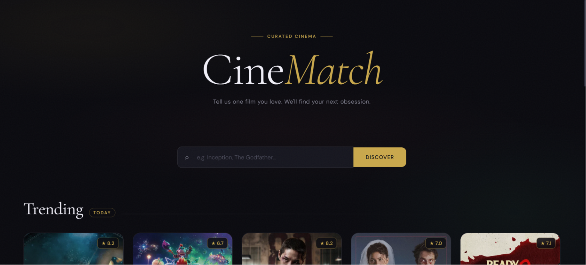
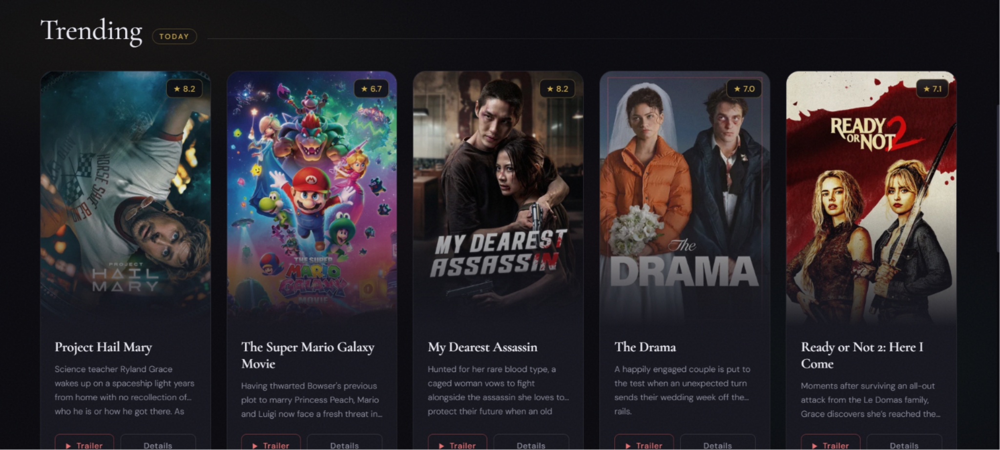
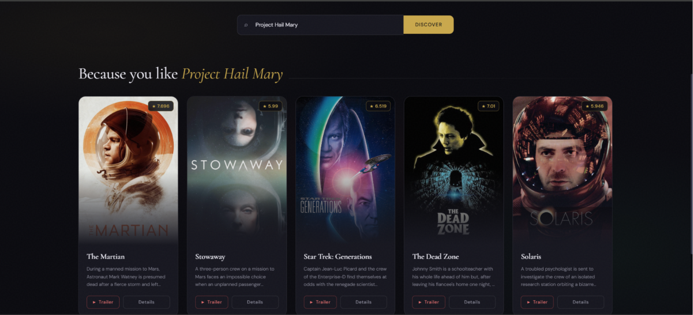

# 🎬 CineMatch — Hybrid Movie Recommendation System

CineMatch is a hybrid movie recommendation web application that helps users discover movies similar to the ones they love.

The project combines:

- 🎯 Content-Based Filtering (Machine Learning)
- 🌐 TMDB API Recommendations
- ⚡ Optimized Similarity Search
- 🎥 Movie Trailers & Metadata
- 🎨 Modern Cinematic UI

---

# 🌐 Live Demo

https://cine-match-movie-recommendation-sys-olive.vercel.app/

---

# 📸 Screenshots

## 🏠 Homepage



---

## 🔥 Trending Movies



---

## 🎯 Personalized Recommendations



---

# 🚀 Features

## ✅ Blended Hybrid Recommendation Engine

The system uses a blended hybrid recommendation architecture:
- Retrieves up to **5 local content-based recommendations** from your custom offline trained model.
- Retrieves up to **5 live recommendations** from the TMDB API (capturing recent, trending, and collaborative filtering matches).
- Combines and **deduplicates** them in real-time, preserving ranking order and falling back gracefully if one source is unavailable.

---

## ✅ Optimized Content-Based Filtering

The custom local model uses:
- NLP preprocessing (stemming, lowercasing, whitespace removal for names).
- Structured tag weighting: `overview` ($3\times$), `genres` ($5\times$), `keywords` ($3\times$), `cast` ($2\times$), and `crew/director` ($4\times$) to prevent token volume dilution.
- **TF-IDF Vectorization** (Term Frequency-Inverse Document Frequency) to extract key term signals.
- **Cosine Similarity** to compute semantic proximity between movie feature vectors.

---

## ✅ Trending Movies Section

Displays daily trending movies fetched directly from TMDB API.

---

## ✅ Detailed Movie Information

Each movie card includes:
- Poster
- Rating
- Overview
- Genres
- Runtime
- Release Year
- Language
- Trailer Link

---

## ✅ Optimized Performance

Several optimizations have been implemented:

- Float32 similarity matrix
- Parallel API requests using ThreadPoolExecutor
- LRU caching
- Trending movies TTL cache
- Lazy-loaded images

---

## ✅ Cinematic UI

Modern responsive frontend inspired by streaming platforms like:
- Netflix
- MUBI
- Letterboxd

---

# 🛠️ Tech Stack

## Backend
- Flask
- Python

## Machine Learning
- Scikit-learn
- NLP
- Cosine Similarity

## Frontend
- HTML
- CSS
- JavaScript

## API
- TMDB API

---

# 📂 Project Structure

```bash
Movie-Recommendation-System/
│
├── static/
│   └── style.css
│
├── templates/
│   └── index.html
│
├── screenshots/
│   ├── home.png
│   ├── trending.png
│   └── recommendations.png
│
├── app.py
├── movie_recommender.py
├── tmdb_api.py
├── train_model.py
│
├── movies.pkl
├── similarity.pkl
│
├── tmdb_5000_movies.csv
├── tmdb_5000_credits.csv
│
├── requirements.txt
├── README.md
├── .gitignore
└── .env
```

---

# ⚙️ Installation

## 1️⃣ Clone the repository

```bash
git clone https://github.com/Adityajhinjha/CineMatch-Movie-Recommendation-System-.git

cd CineMatch-Movie-Recommendation-System-
```

---

## 2️⃣ Install dependencies

```bash
pip install -r requirements.txt
```

---

## 3️⃣ Create `.env` file

Create a `.env` file in the root directory:

```env
TMDB_API_KEY=your_tmdb_api_key
```

---

## 4️⃣ Run the application

```bash
python app.py
```

---

# 🧠 Model Training

To regenerate the recommendation model:

```bash
python train_model.py
```

This generates:
- `movies.pkl`
- `similarity.pkl`

---

# 🌟 Future Scope

## ✅ Collaborative Filtering

Add user-based recommendations using:
- User ratings
- Watch history
- Matrix factorization

---

## ✅ User Authentication

Allow users to:
- Create accounts
- Save favorite movies
- Build watchlists

---

## ✅ Personalized Recommendations

Recommend movies based on:
- User preferences
- Genre interests
- Previously watched movies

---

## ✅ AI Chatbot Integration

Integrate an AI assistant for:
- Mood-based recommendations
- Conversational movie discovery

---

## ✅ Advanced Search System

Add:
- Autocomplete
- Fuzzy search
- Genre filters
- Actor/director filters

---

## ✅ Vector Database Integration

Use:
- FAISS
- Pinecone
- ChromaDB

for scalable recommendation search.

---

# 📚 Dataset

Dataset used:
- TMDB 5000 Movie Dataset

---

# 🙌 Acknowledgements

- TMDB API
- Scikit-learn
- Flask
- Kaggle TMDB Dataset

---

# 👨‍💻 Author

Aditya Jhinjha
